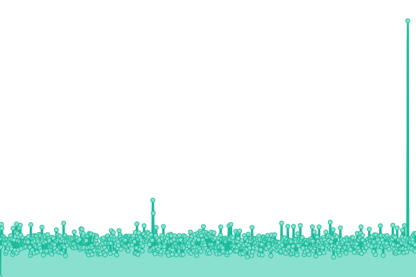
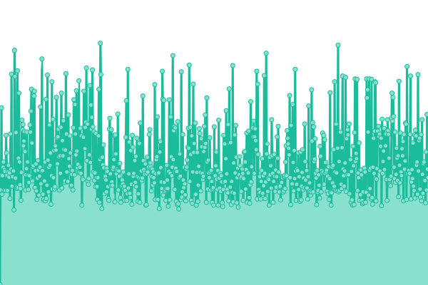
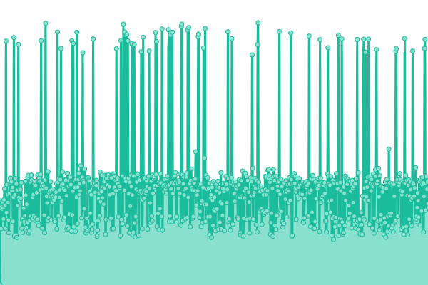
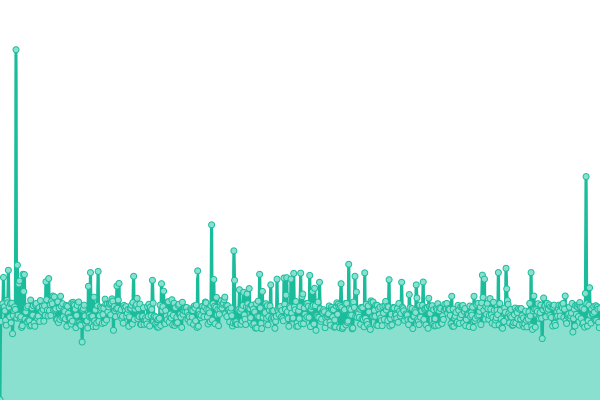

# [📈 Live Status](https://SpecializedBicycles.github.io/retul-uptime-monitor): <!--live status--> **🟩 All systems operational**

This repository contains the open-source uptime monitor and status page for [Specialized Bicycle Components](https://www.specialized.com), powered by [Upptime](https://github.com/upptime/upptime).

With [Upptime](https://upptime.js.org), you can get your own unlimited and free uptime monitor and status page, powered entirely by a GitHub repository. We use [Issues](https://github.com/SpecializedBicycles/retul-uptime-monitor/issues) as incident reports, [Actions](https://github.com/SpecializedBicycles/retul-uptime-monitor/actions) as uptime monitors, and [Pages](https://SpecializedBicycles.github.io/retul-uptime-monitor) for the status page.

<!--start: status pages-->
<!-- This summary is generated by Upptime (https://github.com/upptime/upptime) -->
<!-- Do not edit this manually, your changes will be overwritten -->
<!-- prettier-ignore -->
| URL | Status | History | Response Time | Uptime |
| --- | ------ | ------- | ------------- | ------ |
|  [Premium Fit Health Check](https://api.production.retul.com/premium-fit-service/health_check/) | 🟩 Up | [premium-fit-health-check.yml](https://github.com/SpecializedBicycles/retul-uptime-monitor/commits/HEAD/history/premium-fit-health-check.yml) | 

 621ms
     
 | 

<a href="https://SpecializedBicycles.github.io/retul-uptime-monitor/history/premium-fit-health-check">100.00%</a>
    

|  [Retailer Roles Health Check](https://api.production.retul.com/retailer-roles-service/health_check/) | 🟩 Up | [retailer-roles-health-check.yml](https://github.com/SpecializedBicycles/retul-uptime-monitor/commits/HEAD/history/retailer-roles-health-check.yml) | 

 251ms
     
 | 

<a href="https://SpecializedBicycles.github.io/retul-uptime-monitor/history/retailer-roles-health-check">100.00%</a>
    

|  [Retul at Home Health Check](https://api.production.retul.com/retul-at-home-service/health_check/) | 🟩 Up | [retul-at-home-health-check.yml](https://github.com/SpecializedBicycles/retul-uptime-monitor/commits/HEAD/history/retul-at-home-health-check.yml) | 

 370ms
     
 | 

<a href="https://SpecializedBicycles.github.io/retul-uptime-monitor/history/retul-at-home-health-check">100.00%</a>
    

|  [Passport Health Check](https://api.production.retul.com/passport-service/health_check/) | 🟩 Up | [passport-health-check.yml](https://github.com/SpecializedBicycles/retul-uptime-monitor/commits/HEAD/history/passport-health-check.yml) | 

 407ms
     
 | 

<a href="https://SpecializedBicycles.github.io/retul-uptime-monitor/history/passport-health-check">100.00%</a>
    

|  [Bike Sizing Service Health Check](https://api.production.retul.com/bike-sizing-service/health_check/) | 🟩 Up | [bike-sizing-service-health-check.yml](https://github.com/SpecializedBicycles/retul-uptime-monitor/commits/HEAD/history/bike-sizing-service-health-check.yml) | 

 312ms
     
 | 

<a href="https://SpecializedBicycles.github.io/retul-uptime-monitor/history/bike-sizing-service-health-check">100.00%</a>
    

<!--end: status pages-->

[**Visit our status website →**](https://SpecializedBicycles.github.io/retul-uptime-monitor)

## 📄 License

- Powered by: [Upptime](https://github.com/upptime/upptime)
- Code: [MIT](./LICENSE) © [Specialized Bicycle Components](https://www.specialized.com)
- Data in the `./history` directory: [Open Database License](https://opendatacommons.org/licenses/odbl/1-0/)
